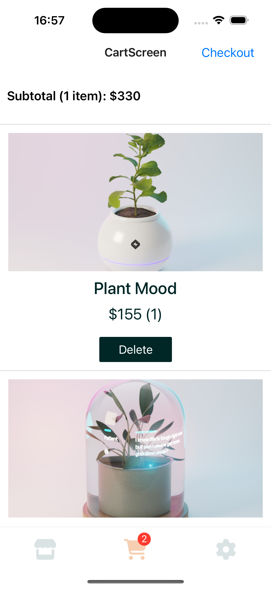

# Sentry Empower Plant React Native Demo

This is demo repo is used by Solution Engineers when demo'ing Sentry's [React Native](https://docs.sentry.io/platforms/react-native) SDK's capabilities.

| Home Screen | Product Detail | Cart |
|------------|----------------|------|
|  |  |  |

## Versions

See [package.json](./package.json) for the up to date information about the `@sentry/react-native` SDK and `react-native` versions.

## Setup

Ensure you have working React Native Development Environment, for the latest steps follow the official guide at https://reactnative.dev/docs/set-up-your-environment. For specific Java versions use [sdkman](sdkman.io) and for Ruby use [rbenv](http://rbenv.org/).

1. `git clone git@github.com:sentry-demos/sentry_react_native.git`
2. Optional - Add your DSN and BACKEND_URL to `src/config.ts`
3. Optional - Create a .env file in project root and add `SE=<value>`
4. `export SENTRY_AUTH_TOKEN=<token>` [How to generate Sentry Auth Token](https://docs.sentry.io/account/auth-tokens/#organization-auth-tokens).
5. `npm install`
6. Only for iOS - `bundle install`
7. Only for iOS - `npx pod-install`

## Development

For local build with hot reload capabilities use the following commands:

```bash
# Metro Development Server - Optional
# npm run start

npm run build-dev-android
npm run build-dev-ios
```

For testing release builds (includes automatic upload of source maps and native debug files) use the following commands:

```bash
npm run build-release-android
npm run build-release-ios
```

## Release

A release is need to automatically generate data for [demo.sentry.io](https://demo.sentry.io)

1. Merge all changes to the default branch (currently `master`).
2. Go to [`Actions` -> `Release`](https://github.com/sentry-demos/sentry_react_native/actions/workflows/release.yml).
3. Click `Run workflow` at the top of the view. If you don't see the button, you don't have permission to trigger the action in this repository.
4. Select `branch` you want to make release from (typically `master`)
5. Write the new version, follow https://semver.org/, for example `5.7.22`.
6. Go to the [`Releases`](https://github.com/sentry-demos/sentry_react_native/releases) page and wait for the new release to appear. The Github workflow might take ~30 mins. Android is done faster ~10 mins, iOS takes longer ~30 mins. Both have to be done for the release to be published.
7. Use the APK and APP zipped artifacts as needed.

## Updating React Native Version

Follow https://react-native-community.github.io/upgrade-helper/

## Troubleshooting

See [troubleshooting.md](./troubleshooting.md) for more tips and tricks.
