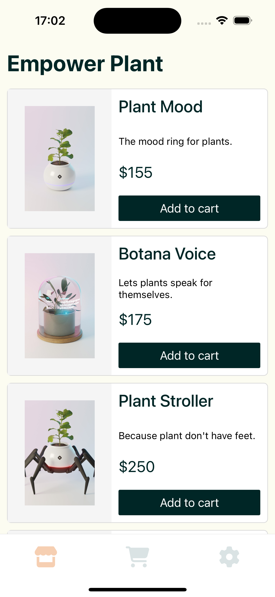

This is demo repo is used by Solution Engineers when demo'ing Sentry's [React Native](https://docs.sentry.io/platforms/react-native) SDK's capabilties.

<!--   -->


[./img](./img) for more screenshots of Empower Plant

## Versions

The values specified in package.json may be more up to date.  
Not all of these have to be used in order to build the app (e.g. Android Virtual Device API) but if you're having problems building, then follow these.  
| dependency      | version
| ------------- |:-------------:|
| react-native     | 0.72.4  |
| gradle           | 6.7?     |
| react           | 18.2.0    |
| sentry/react-native      | ^5.9.1    |
| npx | 7.8.0? |
| node | 20.5.0 |
| npm | 9.8.0 |
| java | 17.0.8 |
| ruby | 3.2.2 |
| AndroidStudio | Bumblebee 2021.1.1 Patch 2 |
| Android Virtual Device | Pixel_6_API_30 |


## Setup
See 'Versions' table above for some dependencies you'll need. Recommend using [sdkman](sdkman.io) for easily installing the right java version.

1. git clone git@github.com:sentry-demos/sentry_react_native.git
2. Add your DSN and BACKEND_URL for back-end to src/config.ts
3. `export const SENTRY_AUTH_TOKEN=<token>`
4. Setup a Android Virtual Device via AVD Manager.
5. If you don't have cocoapods or get an error about cocopods out of date, run `gem install cocoapods`
6. `npm install`
7. `cd ios && pod install`
8. Optional - Create a .env file in project root and add `SE=<value>`

## Run Android
These steps were last tested on Sept 6th, 2023:  

1.
```
// this tends to give errors once you run the app. avoid this.
cd android
npm run android // this command executes `react-native run-android` and does hot-reload
```
If step 1 is failing, try building a release and running that in the emulator:

2.
```
// Creates the apk of the app in /android/app/build/outputs/apk/release/app-release.apk
cd android
./gradlew assembleRelease 
```

3.
```
// runs the apk you created in steps1,2
emulator -avd Pixel_6_API_34 -netdelay none -netspeed full -dns-server 8.8.8.8

// optional, do this if you think you're not getting the updated app on your emulator
./gradlew installRelease // Installs release build of the app to the currently connected Android device/emulator
```

optional
```
Gradle commands allow you to gradually control what you want to do, like avoiding rebuilding the app if you changed your emulator.
cd android
./gradlew installDebug // Installs debug build of the app to the currently connected Android device/emulator
./gradlew installRelease // Installs release build of the app to the currently connected Android device/emulator

```

Old Steps from before Sept 6th, 2023:  
```
Android (optional) start the emulator by AVD Manager or:

// emulator executable is at /Users/<user>/Library/Android/sdk/emulator
emulator -list-avds
emulator @<YourEmulator> -dns-server 8.8.8.8
emulator @Pixel_3_API_30_x86_64 -dns-server 8.8.8.8

// This builds the APK for the arch and installs to the emulator.
npx react-native run-android --variant Release
```

## Run iOS

```
npm run ios -- --mode=Release
```

These steps were last tested before Sept 6th, 2023:
Deprecation warning on using npx?
```
# opens the Metro debugger, has hot reload
npx react-native run-ios --configuration Debug

## builds a Release (takes longer)
npx react-native run-ios --configuration Release
npx react-native run-ios --simulator="iPhone 11"
```

## SDK Upgrade Path
1. `rm -rf node_modules && npm install`. For iOS, run `pod install` or `pod update`. For Android, it should pull in latest dependenices automatically as you start building again.
2. If you're getting build errors, you may need to upgrade all your Node, npm, Java, VirtualDevices. This is due to either the previously merged PR relying on them, or the next SDK and RN versions you're upgrading to require them, or both.

# How To Create a Release

You must complete all of the following steps when setting a new release version:

## 1. Tick the release version forward.

:warning: If you have edited the `.env` file to locally change the value of the `SE` tag, change it back to `SE=tda` ! Otherwise, whatever value you have set there will get inadvertently included in the release (ask me how I know). If you have no idea what the previous sentences mean, you can ignore this warning. :warning:

There is only one command needed here:

```
$ npm version patch
```

This:
- Increments version by 0.0.1, i.e. `2.0.1` -> `2.0.2`.
- Automatically keeps versioning consistent across package.json and associated android and ios files
- Automatically creates a commit for the newly created release, i.e. `2.0.2`

You should see:


We can run `git log` to confirm that the release commit for `2.0.2` was created:


Be careful about which project you are pointing to when you start ticking releases forward or triggering them. Note that once you tick the release version forward locally (i.e. to `2.0.2`), if you locally trigger an error, the Sentry project you're pointing to will start reporting that error as associated with release `2.0.2` (even though your code is being run locally and is technically not deployed). Such are the dangers of having a demo app's release process not occur during a typical release pipeline.

The `npm version patch` command automatically keeps releases consistent across `package.json`, `Info.plist`, and `build.gradle` thanks to [react-native-version](https://github.com/stovmascript/react-native-version).

## 2. Create a Github Release

It's also crucial that we create a Github release so that our automated test jobs (located in the [application-monitoring repo](https://github.com/sentry-demos/application-monitoring/tree/master/tests)) can create data in Sentry based on the latest react native code.

What’s the purpose of this? 

Basically in the Github releases, we want to make sure certain artifacts are uploaded. For example in this release I did, 1.9, we have .apk and .app.zip artifacts uploaded. The generated artifacts will be uploaded to the Github Release we create. Then, our automated ‘TDA’ (test data automation) tests will use these builds of the app to generate data and populate our Sentry demo projects.

This is a guide of how to build those artifacts and create a Github Release, while uploading the relevant artifacts along with the release.

### Generate Release/Debug Artifacts

(:pencil2: I'm hoping to make this a less manual process in the future so that you can just run one or two scripts. Unfortunately some things I haven't figured out about Xcode are preventing that. -Chris)

First: ensure your local repo is up to date with the Github `master` branch via `git pull origin master`.

#### iOS

1. Generate the Release build
- `cd` into the root repository directory - `sentry_react_native`
- Run `npx react-native run-ios --configuration Release`. This will start the iPhone simulator and launch the app but we don’t care about that -- this command also creates the release build. 
- This will result in a directory being populated under /Users/cstavitsky/Library/Developer/Xcode/DerivedData (replace cstavitsky with your local username). There will be a sentry-react-native-<bunch of random chars> directory. You will see it output once the `npx` command above completes:


- Copy the newly created release artifact into the current directory from the output (marked in blue underline above): `cp -r /Users/cstavitsky/Library/Developer/Xcode/DerivedData/sentry_react_native-dgoblbkgunhkxscqaagaqprvjqus/Build/Products/Release-iphonesimulator/sentry_react_native.app sentry_react_native.app` [your hash sentry_react_native-<....> will probably be different]
- Zip the copied directory so that the .zip can be uploaded along with the Github release: `zip -r sentry_react_native.app.zip sentry_react_native.app`
- If you do a `git status` you should see that `sentry_react_native.app.zip` was `modified`.
- Run `git add sentry_react_native.app.zip`

2. Generate the Debug build
- Run `npx react-native run-ios --configuration Debug`. This will start the iPhone simulator and launch the app but we don’t care about that -- this command also creates the debug build. 
- This will result in a directory being populated under /Users/cstavitsky/Library/Developer/Xcode/DerivedData (replace cstavitsky with your local username). There will be a sentry-react-native-<bunch of random chars> directory.
- Copy the newly created release artifact (shown in output after running the `npx` command, similar to the Release screenshot above with filepath underlined in blue) into the current directory: `cp -r /Users/cstavitsky/Library/Developer/Xcode/DerivedData/sentry_react_native-dgoblbkgunhkxscqaagaqprvjqus/Build/Products/Debug-iphonesimulator/sentry_react_native.app sentry_react_native_debug.app` [your hash sentry_react_native-<....> will probably be different]
- Zip the copied directory `zip -r sentry_react_native_debug.app.zip sentry_react_native_debug.app`
- Run `git add sentry_react_native_debug.app.zip`

### Android
  
1. Generate the Release build
- Run `npx react-native run-android --variant Release`. This will generate the Android release build. Ignore the emulator.
- Copy the release build to the root directory of the project: `cp android/app/build/outputs/apk/release/app-release.apk ./`
- Run `git add app-release.apk`
  
2. Generate the Debug build
- Run `npx react-native run-android --variant Debug`. This will generate the Android debug build. Ignore the emulator.
- Copy the debug build to the root directory of the project: `cp android/app/build/outputs/apk/debug/app-debug.apk ./`
- Run `git add app-debug.apk`

Create a Github Release:

Note: do not proceed with this until you have done all the previous steps.

1. (If this is your first time doing this, run `brew install gh` to install the Github CLI tool. Once you install it, you can skip this step in the future)
2. Commit the four files `git commit -m “Add release artifacts”`
3. Run the release script `./github_release.sh`, and select yes when prompted.

Your new release should be [visible on Github](https://github.com/sentry-demos/sentry_react_native/releases).

### Updating the version of the Demo App itself
Don't forget to bump your release version depending on platform.  
iOS: `Info.plist` `CFBundleShortVersionString`  
android: `app.build.gradle` `versionName`  

## Troubleshooting
[Troubleshooting.md](./troubleshooting.md)

### [Troubleshooting - Locally undoing an accidental increment of the release version]

If you accidentally tick the version forward by running `npm version patch`, and did not intend to do so, you can undo this.

Let's say we were previously on `2.0.1` and accidentally ran the command twice, ticking the release to `2.0.2` and `2.0.3`, but we only wanted to go to `2.0.2`.

- First, run `git log`.
- Copy the commit hash associated with the previous commit that you want to reset to.


- run `git reset <the commit hash>`.
- Check out any unwanted files that are no longer staged for commit.

