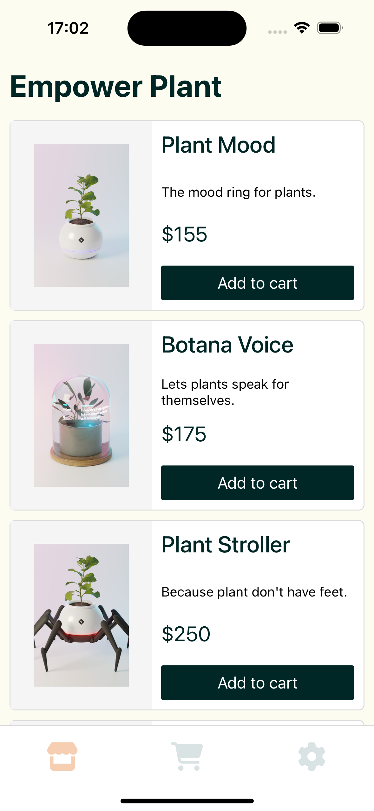
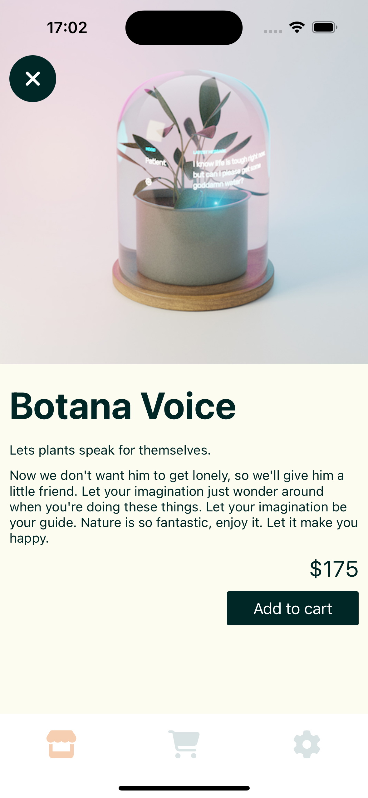
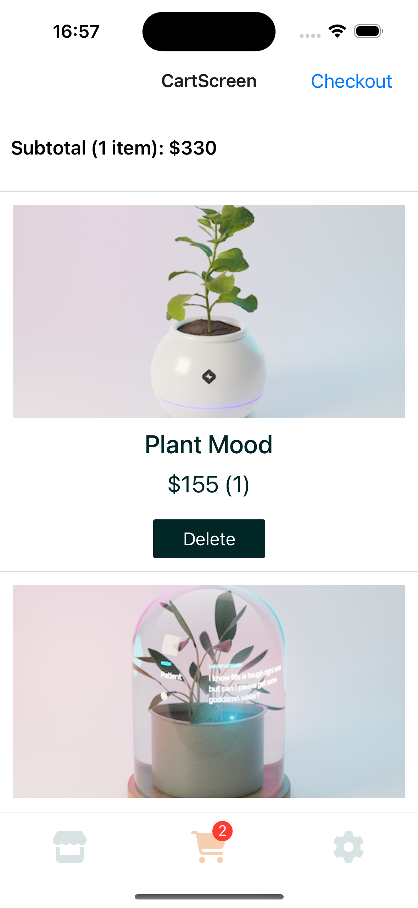

# Sentry Empower Plant React Native (Expo) Demo

This is a demo repo used by Solution Engineers when demo'ing Sentry's [React Native](https://docs.sentry.io/platforms/react-native) SDK's capabilities. This version is built with [Expo](https://expo.dev) (SDK 57).

| Home Screen | Product Detail | Cart |
|------------|----------------|------|
|  |  |  |

## Versions

See [package.json](./package.json) for up to date information about the `@sentry/react-native` SDK, `react-native`, and `expo` versions.

## Setup

1. `git clone git@github.com:sentry-demos/sentry_react_native.git`
2. Optional — Add your DSN and BACKEND_URL to `src/config.ts`
3. Optional — Create `.env.local` in project root and add `EXPO_PUBLIC_SE=<value>`
4. `export SENTRY_AUTH_TOKEN=<token>` — [How to generate a Sentry Auth Token](https://docs.sentry.io/account/auth-tokens/#organization-auth-tokens)
5. `npm install`

## Development

This app uses native modules (the Sentry config plugin), so it can't run in Expo Go —
`npm run android` / `npm run ios` generate the native projects and build a dev client.

```bash
# Start the Metro dev server against an already-installed dev build
npm start

# Generate the native project and build/install it
npm run android
npm run ios
```

For release builds, the same flow CI uses (see `.github/workflows/build-*.yml`):

```bash
npx expo prebuild --platform android
cd android && ./gradlew :app:assembleRelease
```

The generated `android/` and `ios/` directories are gitignored — `expo prebuild`
recreates them from `app.config.js`, so don't edit them by hand.

## Environment Variables

Expo reads `.env.local` automatically. Variables must be prefixed with `EXPO_PUBLIC_` to be accessible in app code:

```
EXPO_PUBLIC_SE=tda
```

This replaces the `react-native-dotenv` / `@env` approach from the bare RN version.

## Differences from the bare React Native version

| Area | Bare RN | Expo |
|------|---------|------|
| Icons | `react-native-vector-icons` | `@expo/vector-icons` (built-in) |
| Env vars | `import {SE} from '@env'` | `process.env.EXPO_PUBLIC_SE` |
| Metro config | `withSentryConfig` | `getSentryExpoConfig` |
| Build | `react-native run-*` | `expo prebuild` + `expo run:*` |
| Sentry plugin | Android Gradle plugin | Expo config plugin (`@sentry/react-native`) |

## Troubleshooting

See [troubleshooting.md](./troubleshooting.md) for tips.
